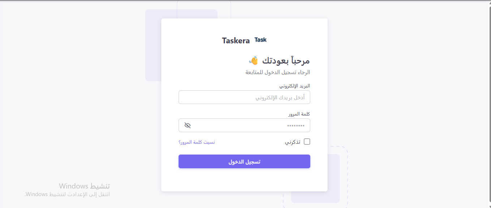
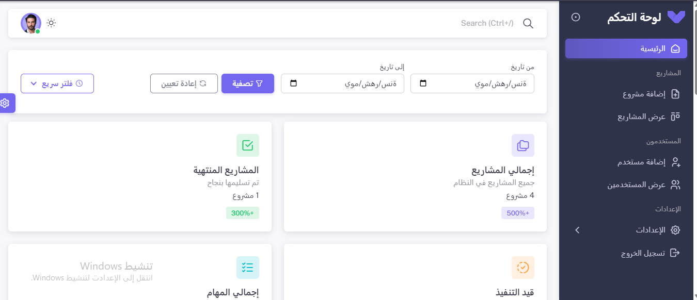

# Laravel Task Management System

A complete task management system built with Laravel 11 featuring user authentication, CRUD operations, and interactive dashboards.

### Authentication System
- User login/logout
- Password reset

### User Management
- Add new users
- Edit user profiles
- View user details
- Delete users

### Project Management
- Create projects
- Edit project details
- Delete projects
- Project progress tracking

### Task Management
- Create tasks with deadlines
- Edit task details
- Delete tasks
- Drag-and-drop sorting
- Status updates (To Do, In Progress, Done)
- Task filtering by status

### Dashboard Analytics
- Projects statistics
- Tasks completion rates
- User activity overview
- Visual charts and graphs

## Screenshots

| Login Page | Dashboard |
|------------|-----------|
|  |  |

| User Management | Task Board |
|-----------------|------------|
|  |  |

## System Requirements

- PHP 8.2 or higher
- MySQL 5.7+ or MariaDB 10.3+
- Composer 2.0+
- Node.js 16+ (for frontend assets)

